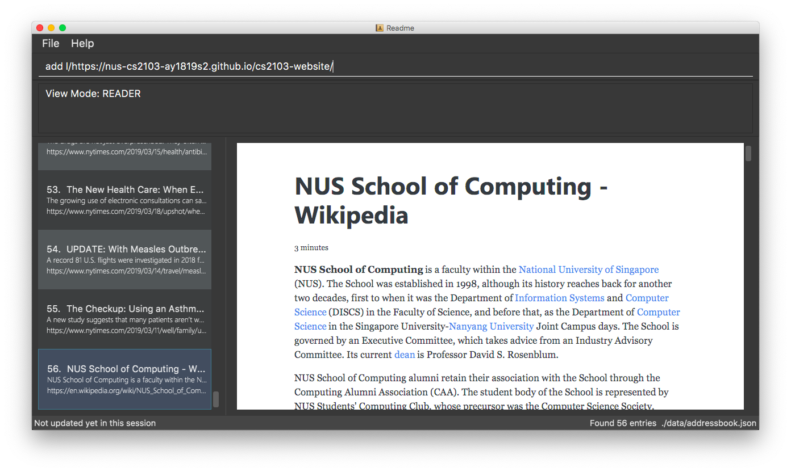

= README
ifdef::env-github,env-browser[:relfileprefix: docs/]

https://travis-ci.org/CS2103-AY1819S2-W10-1/main[image:https://travis-ci.org/CS2103-AY1819S2-W10-1/main.svg?branch=master[Build Status]]
https://ci.appveyor.com/project/thomastanck/main[image:https://ci.appveyor.com/api/projects/status/k99mmh3peur0nef5?svg=true[Build Status]]
https://coveralls.io/github/CS2103-AY1819S2-W10-1/main?branch=master[image:https://coveralls.io/repos/github/CS2103-AY1819S2-W10-1/main/badge.svg?branch=master[Coverage Status]]
https://www.codacy.com/app/thomastanck/main?utm_source=github.com&utm_medium=referral&utm_content=CS2103-AY1819S2-W10-1/main&utm_campaign=Badge_Grade[image:https://api.codacy.com/project/badge/Grade/cb4fa0d78e424d9d9eb3faf34102e157[Codacy Badge]]

ifdef::env-github[]

endif::[]

ifndef::env-github[]
image::images/Ui.png[width="600"]
endif::[]

* README helps you discover, curate and read more content you care about in less time.
* *All-in-one*: Follow web feeds and bookmark web pages - save interesting articles, cooking recipes, song lyrics, or anything else you come across while browsing.
* *Read Anywhere*: Read offline, anywhere and anytime you want - all the links you save are downloaded onto your personal computer so you'll never lose them.
* *Stay Focused*: Consume more content, more comfortably - reading view strips away clutter like buttons and ads for better readability.
* *Keep Organized*: Curate your content - organize and categorize your feeds and links and find them quickly with powerful search, sort and filter functionality.
* *Fast*: Never leave your keyboard - single-shot commands and keyboard shortcuts let you do more in less time.
* You'll love README if you're a heavy consumer of web content but don't have regular internet access, whether because you often head off on long flights or you love working in cafes, and refuse to pay exorbitant prices for Internet access anywhere.

* This is an integrated bookmark manager and feed reader desktop application for saving web pages and feeds to read later on your personal computer. It has a GUI but most of the user interactions happen using a CLI (Command Line Interface).

== Site Map

* <<UserGuide#, User Guide>>
* <<DeveloperGuide#, Developer Guide>>
* <<LearningOutcomes#, Learning Outcomes>>
* <<AboutUs#, About Us>>
* <<ContactUs#, Contact Us>>

== Acknowledgements

* This application is based on the AddressBook-Level4 project created by the SE-EDU initiative at https://github.com/se-edu/.
* Some parts of this application were inspired by the excellent http://code.makery.ch/library/javafx-8-tutorial/[Java FX tutorial] by
_Marco Jakob_.
* Libraries used: https://github.com/TestFX/TestFX[TestFX], https://github.com/FasterXML/jackson[Jackson], https://github.com/google/guava[Guava], https://github.com/junit-team/junit5[JUnit5]

== Licence : link:LICENSE[MIT]
